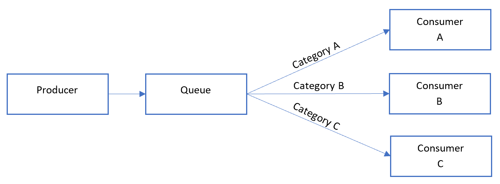
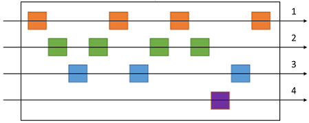

# Sequential Convoy

[!INCLUDE [header](../_includes/header.md)]

## Context and problem

Often, enterprises need the ability to process messages in the order in which they arrived, but in a way that allows the architecture to scale - often "infinitely" - to meet the needs of the load. First-in-first-out (FIFO) processing of messages is not straightforward in a distributed architecture like the cloud where many workers can scale independently of one another and often pull messages off queues, buses, or other messaging mechanisms independently.

Let's suppose you're working with an order-tracking system which receives a ledger containing orders and the relevant operations on those orders. These operations could be to Create an order, Add a Transaction to it, Modify a past Transaction, or even Delete an order. In this system, it's imperative these operations be performed in a first-in-first-out manner, but only at the order level. However, what your initial queue receives is a ledger containing transactions for many orders.

## Solution

By pushing related messages in to categories within the queuing system, and forcing listeners on the queue to lock & pull only from one category, one message at a time, we can achieve this goal even in a distributed system.

For the above scenario the approach, using Sequential Convoy, would be to process each ledger message one-at-a-time in the order in which it is received by sending each transaction within it to another queue where category = Order ID. Then, consumers could process each category in parallel (as a transaction would never span multiple orders), but first-in-first-out within the category (i.e. one transaction at a time).

## Issues and considerations

Consider the following points when deciding how to implement this pattern:

- Category/Scale unit - what property, if any, of your incoming messages *can* you scale out on?
- Throughput - what is your target message throughput? If it is very high, you may need to reconsider your FIFO requirements.
- Service capabilities - do provided services offer the level of control to allow for one-at-a-time processing of messages within a queue or category of a queue?
- Future scale - what will the process of adding a new category of message to the system look like?

## When to use this pattern

Use this pattern when:

- You have messages which **arrive in order** and must be **processed in the same order**.
- Arriving messages are or can be "categorized" in such a way that the category becomes a unit of scale for the system.

This pattern might not be suitable:

- Extremely high throughput scenarios (millions of messages/minute or second) as the FIFO requirement clamps the scaling which can be done by the system.

## Example

On Azure, this pattern can be implemented using Azure Service Bus and Message Sessions on Session-based queue coupled with either Azure Logic Apps' Peek Lock trigger or Azure Functions' Service Bus Trigger.

Here's what the general Sequential Convoy pattern looks like:

Where, in the queue, messages are received and delivered in a manner similar to this:

Now, for our example we have 2 queues which utilize FIFO, but we "fan out" by debatching the content of each message in our first queue, so while the queue behaviors are similar to above, there is a slight difference:

Our ledger processor takes care:
1. Walking the ledger one transaction at a time
2. Setting - in the case of Service Bus - the Session ID of the message to match the Order ID
3. Sending each transaction on to a secondary queue with the Session ID set to the Order ID

Then, our consumers are listening to the secondary queue where they:  
1. Peek-lock any time a new Session is found, locking the session from being picked up by other consumers
2. Process all messages with matching Session IDs in order from the queue

Here, when considering scalability, our ledger queue is a primary bottleneck as we cannot fan out since many ledgers could reference the same Order IDs (e.g. update a previously-created order) as transactions are performed and ledgers are submitted throughout the day. However, once we are able to fan out *after* the ledger to N number of orders in our serverless environment.

## Next steps

The following information may be relevant when implementing this pattern:

- <a href="https://docs.microsoft.com/en-us/azure/service-bus-messaging/message-sessions" target="_blank">Service Bus Message sessions</a>
- <a href="https://docs.microsoft.com/en-us/rest/api/servicebus/peek-lock-message-non-destructive-read" target="_blank">Service Bus Peek Lock REST API</a>
- <a href="https://blogs.msdn.microsoft.com/logicapps/2017/05/02/in-order-delivery-of-correlated-messages-in-logic-apps-by-using-service-bus-sessions/" target="_blank">In order delivery of correlated messages in Logic Apps by using Service Bus sessions</a>
